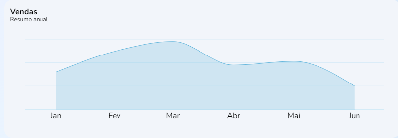

import Tabs from '@theme/Tabs';
import TabItem from '@theme/TabItem';
import Mermaid from '@site/src/theme/Mermaid';


# AnnualSales: annual sales summary

## Method: AnnualSales
--- 


### Summary
Chart for monthly Sales summary ilustrating fluctuations over a semester. Callsbacks for `date` and `value` elements.

## Syntax
---
<Tabs
defaultValue="Function"
values={[
  {label: 'Function', value:'Function' },
  {label: 'Interface', value:'interface' },
  {label: 'Schema', value:'Schema'}
]
}>
<TabItem value="Function">

```typescript title="src/pages/Home/components/SalesChart/index.tsx"

export function SalesChart() {
  const theme = useTheme()

  const [loading, setLoading] = useState(false)
  const [annualSales, setAnnualSales] = useState<IAnnualSales[] | null>(null)

  const fetchData = useCallback(async () => {
    if (!loading) {
      try {
        setLoading(true)

        const { data } = await fakeRequest(2000, {
          sales: [
            {
              date: new Date('2022-01-31').getTime(),
              value: 80
            },
            {
              date: new Date('2022-02-28').getTime(),
              value: 124
            },
            {...}
          ]
        })

        if (data) {
          setAnnualSales(data.sales)
        }
      } catch {
        setAnnualSales([])
      } finally {
        setLoading(false)
      }
    }
  }, [loading])

  useEffect(() => {...}, [annualSales, theme])

  return (...)
}
```
</TabItem>
<TabItem value="interface">

```typescript title="src/pages/Home/components/SalesChart/index.tsx"

interface IAnnualSales {
  date: number
  value: number
}
```
</TabItem>
<TabItem value="Schema">

```json title="SCHEMA de resposta"

{
  "$schema": "http://services/api"

  "AnnualSales": {
    "type": "object",
    "properties": {
      "date": {
        "type": "number",
        "example": "2022-01-31",
        "format": "date",
        "readOnly": true
      },
      "value": {
        "type": "number",
        "format": "double",
        "default": 0,
        "example": 124,
        "minimum": 0,
        "readOnly": true
      }
    }
  }
}
```
</TabItem>
</Tabs>

## Desciption 
---
The `SalesChart()` function takes a `useState()` hook to construct the `annualSales` and `setAnnualSales` elements from the `date` and `value` values in the `IAnnualSales{}` object

## Parameters
---
Parameters | Data type | Definition|
---------|-----|----------|---------
 `date` |number| Período de tempo em que o pedido foi realizado
 `value`|number| Número de pedidos realizados no período 


### Procedures
### `PRC_VEND_GRAF_CONS`
The referred parameters follow these database settings:

Parameters |Requirement| Data type  
---------|-----|----------
`@DT_VEND` |true|DATE
`@NM_VEND_DATA`|true|INT
`@NR_PAGE_INIC`|true| INT
`@UUID_USUA`|true|VARCHAR(36)
`@UUID_VEND`|true|VARCHAR(36)


