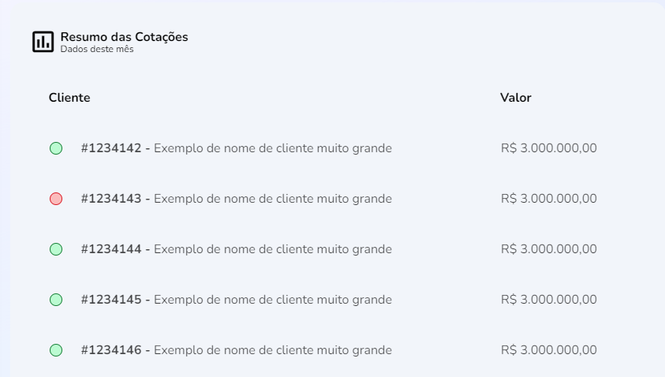

import Tabs from '@theme/Tabs';
import TabItem from '@theme/TabItem';

# PriceQuotes: summary of quotes

## Method: PriceQuotes
--- 


### Summary
Four-parameter population method for `identification`, `status`, `comercial name` and `value` for the quotation summary table on the Home-page.

## Syntax
---
<Tabs
defaultValue="Function"
values={[
  {label: 'Function', value:'Function' },
  {label: 'Interface', value:'interface' },
  {label: 'Response', value:'Response'},
  {label: 'Schema', value:'schema'}
]
}>
<TabItem value="Function">

```typescript title="src/pages/home/components/PriceQuotes/index.tsx"

export function PriceQuotes() {
  const [result, setResult] = useState<IPriceQuote[] | null>(null)

  const fetchData = useCallback(async () => {
    try {
      const { data } = await fakeRequest(2000, {
        quotes: [
          {
            id: 1234142,
            status: 'active',
            tradingName: 'Exemplo de nome de cliente muito grande',
            value: 3000000
          },
          {
            id: 1234143,
            status: 'inactive',
            tradingName: 'Exemplo de nome de cliente muito grande',
            value: 3000000
          },
          {...}
        ]
      })

      if (data) {
        setResult(data.quotes)
      }
    } catch {
      setResult([])
    }
  }, [])
```
</TabItem>
<TabItem value="interface">

```typescript title="src/pages/home/components/PriceQuotes/index.tsx"
interface IPriceQuote {
  id: number
  status: 'active' | 'inactive'
  tradingName: string
  value: number
}
```
</TabItem>
<TabItem value="Response">

```typescript title="src/pages/home/components/PriceQuotes/index.tsx"

{
  PriceQuotes[{
      id: 1234142,
      status: 'active',
      tradingName: 'Exemplo de nome de cliente muito grande',
      value: 3000000
    },
    {
      id: 1234143,
      status: 'inactive',
      tradingName: 'Exemplo de nome de cliente muito grande',
      value: 300000
    },
    {
      id: 1234144,
      status: 'active',
      tradingName: 'Exemplo de nome de cliente muito grande',
      value: 3000000
    }
    {
      id: 1234145,
      status: 'active',
      tradingName: 'Exemplo de nome de cliente muito grande',
      value: 3000000 
    }
    {
      id: 1234146,
      status: 'active',
      tradingName: 'Exemplo de nome de cliente muito grande',
      value: 3000000
    }
  ]
}
```

</TabItem>
<TabItem value="schema">

```json title="Schema de resposta"
{
  "$schema": "http://services/api"

  "PriceQuotes": {
    "type": "object",
    "properties": {
      "id": {
        "type": "integer",
        "example": 1234142,
        "minimum": 0,
        "readOnly": true
      },
      "status": {
        "type": "string",
        "pattern": "(?:^|\\W)active|inactive(?:$|\\W)",
        "example": "active | inactive"
        },
      "tradingName": {
        "type": "string",
        "pattern": "[A-Z a-z]",
        "example": "Exemplo de nome de cliente muito grande"
      },
      "value": {
        "type": "number",
        "format": "double",
        "example": 30000,
        "minimum": 0,
        "readOnly": true
      }
    }
}
```
</TabItem>
</Tabs>


:::info Rotas utilizadas
A API dependerá da importação da rota `ROUTE_SELLER_DASHBOARD`
```javascript
  import { ROUTE_SELLER_DASHBOARD } from 'routes/Pages/Seller/paths'
```
:::

## Description
---
The `PriceQuotes{}` function has a `useState` hook to the `IPriceQuote` object elements, using the `id`, `status`, `tradingName`, and `value` elements.

## Parameters
---
Parameters |Data type  | Definition|
---------|----------|---------
 `id` |number| Identifying code for singular accounts
 `status`| string | activity indicator
 `tradingName` | string | Client's commercial alias 
 `value`| number | Value of the quotes

<p></p>

:::info the 'status' variable will only accept the values `active`🟢 or `inactive`🔴, each having an associated color-code:
 
 **Status**|**Color code**|**Type**
 -----|-----|-----
 active | #BBFBD1 | string
 inactive | #FBBBBB| string
:::

### Procedures
### `PRC_RESU_COTA_CONS`
The referred parameters follow these database settings:

Parâmetros |Requerimento|Tipo de dado  
---------|-----|----------
`@ID_COTA_CLIEN` |true|INT
`@IN_STAT`|true| BIT
`@NM_COTA_CLIEN`|true|VARCHAR(100)
`@NR_COTA_VALO`|true|MONEY
`@UUID_USUA`|true|VARCHAR(36)
`@UUID_VEND`|true|VARCHAR(36)

## Errors
---

Error title | Error code |Definition
---|---|---
ID_NOT_FOUND| |Client's ID could not be found