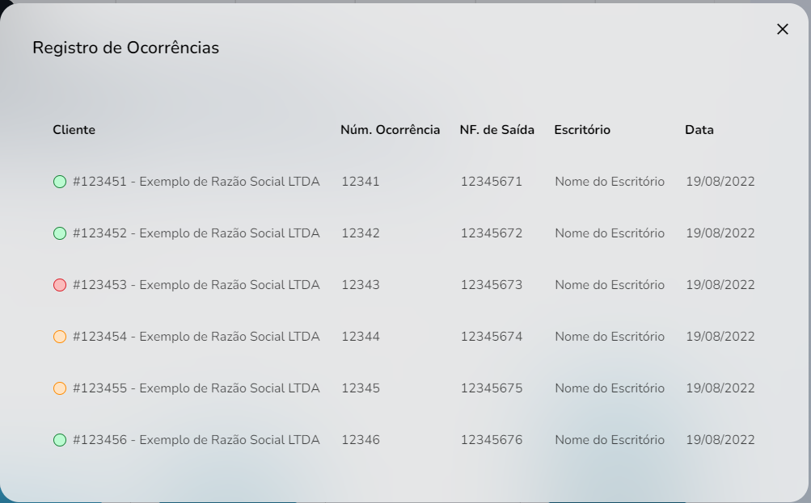

import Tabs from '@theme/Tabs';
import TabItem from '@theme/TabItem';

# Registro de Ocorrências - modal
## Method: OccurrencesRecordModal 
___




## Syntax
____

In case of error, the result will be set as `undefined`.

<Tabs defaultValue="Function"
values={[
  {label:  'Function', value:'Function' },
  {label:  'Interface', value:'interface' },
  {label:  'Response', value:'Response'}
  ]
}>
<TabItem  value="Function">

```typescript title="src/pages/Seller/Dashboard/components/OccurrencesRecord/Modal\index.tsx"

export function OccurrencesRecordModal({ ocurrenceId, onClose }: Props) {
  const [result, setResult] = useState<IOcurrenceRecord[] | undefined | null>(
    null
  )

  const fetchData = useCallback(async (ocurrenceId: number) => {
    try {
      setResult(null)

      await fakeRequest(2000, { ocurrenceId })

      setResult([
        {
          customerId: 123451,
          companyName: 'Exemplo de Razão Social LTDA',
          ocurrenceId: 12341,
          invoicingId: 12345671,
          officeName: 'Nome do Escritório',
          creationDate: '2022-08-19',
          occurrenceName: 'Concluída'
        },
        {
          customerId: 123452,
          companyName: 'Exemplo de Razão Social LTDA',
          ocurrenceId: 12342,
          invoicingId: 12345672,
          officeName: 'Nome do Escritório',
          creationDate: '2022-08-19',
          occurrenceName: 'Concluída'
        },
        {...}
      ])
    } catch {
      setResult(undefined)
    }
  }, [])

  useEffect(() => {
    ocurrenceId && fetchData(ocurrenceId)
  }, [fetchData, ocurrenceId])

  const handleOcurrenceName = useCallback((ocurrenceName: string) => {
    switch (ocurrenceName) {
      case 'Em análise':
        return 'default'

      case 'Sinalização':
        return 'helper'

      case 'Reclamação':
        return 'warning'

      default:
        return 'success'
    }
  }, [])

  return (...)
}
```

</TabItem>

<TabItem value="interface">

```typescript  title="src/pages/Seller/Dashboard/components/OccurrencesRecord/Modal/index.tsx"
interface IOcurrenceRecord {
  customerId: number
  companyName: string
  ocurrenceId: number
  invoicingId: number
  officeName: string
  creationDate: string
  occurrenceName: string
}

interface Props {
  ocurrenceId: number | null
  onClose: () => void
}
```

</TabItem>

<TabItem value="Response">

```typescript  title="src/pages/Seller/Dashboard/components/OccurrencesRecord/Modal/index.tsx"
const res: Props = {
  data: [
    {     
      customerId: 123451,
      tradingName: 'Exemplo de Nome Fantasia',
      phone: '(99) 99999-9999',
      email: 'exemplodeemail@email.com.br'
    },
    {
      customerId: 123452,
      tradingName: 'Exemplo de Nome Fantasia',
      phone: '(99) 99999-9999',
      email: 'exemplodeemail@email.com.br'
    },
    {...}
  ]
}
```

</TabItem>

</Tabs>

## Description
The `OccurrencesRecordModal{}` function, activated by clicking on the occurrence record graph, uses the `useState()` hook to take over the `IOccurrencesRecord` elements by applying the `result` and `setResult` values.

Upon error or failure of the function, the result is set to `undefined`.

## Parameters
------------

Parameters |Data type  | Definition|
---------|-----|----------|---------
`customerId`|number | Identification code for the costumer
`companyName`|string | Name of the company envolved with the occurrence
`OccurenceId`|number | Identification code for the occurrence
`invoicingId`|number | Identification code for the invoice
`officeName`|string | Name of the office envolved with the occurrence
`creationDate`|string | Occurrence's date of creation
`occurrenceName`|string | Name for the occurence 


