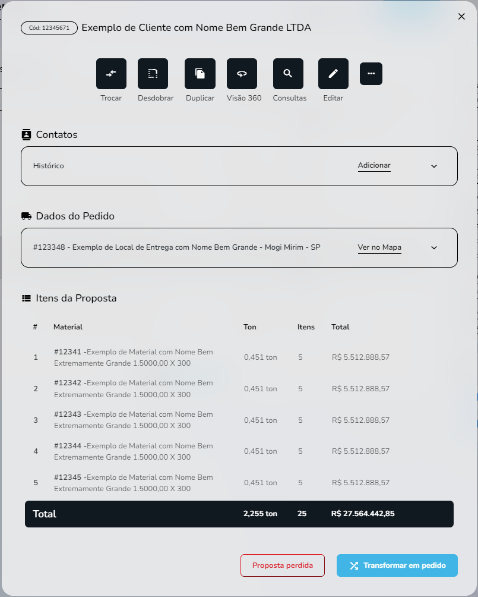

import Tabs from '@theme/Tabs';
import TabItem from '@theme/TabItem';

# Detalhes do ciclo de vendas

## Método: useAuditingAddress
--- 

?????




## Sintaxe
---
```javascript Source - front end
//src/hooks/Auditing/useAddress.ts
//Função:
export function useAuditingAddress() {
  const [params, setParams] = useState<Record<string, any> | null>(null)

  const [result, setResult] = useState<
    IApiResponse<IAuditingAddress> | undefined | null
  >(null)

  const fetchData = useCallback(async (params: Record<string, any>) => {
    try {
      setResult(null)

      await fakeRequest(2000, {
        search: params.search,
        searchingBy: params.searchingBy,
        records: params.records,
        status: params.status,
        initialDate: convertDateToString(params.initialDate),
        finalDate: convertDateToString(params.finalDate),
        sellerId: params.sellerId,
        page: params.page
      })

      setResult(res)
    } catch {
      setResult(undefined)
    }
  }, [])

  const refetch = useCallback(() => {
    params && fetchData(params)
  }, [params, fetchData])

  useEffect(() => {
    params && fetchData(params)
  }, [params, fetchData])

  return { result, params, refetch, setParams }
}
          
```
```typescript
//src/hooks/Auditing/useAddress.ts
//Interface:
export interface IAuditingAddress {
  id: number
  auditorName: string
  auditingDate: string
  customerId: number
  companyName: string
  status: boolean | undefined
  lastUpdateDate: string
}
````
```typescript
//src/hooks/Auditing/useAddress.ts
//Exemplos de retorno:
const res: IApiResponse<IAuditingAddress> = {
  data: [
    {
      id: 12345671,
      auditorName: 'Thomaz Fernandes',
      auditingDate: '2022-07-08',
      customerId: 12341,
      companyName: 'Cliente com Nome bem grande mesmo',
      status: undefined,
      lastUpdateDate: '2022-06-30'
    },
    {
      id: 12345672,
      auditorName: 'Thomaz Fernandes',
      auditingDate: '2022-07-08',
      customerId: 12342,
      companyName: 'Cliente com Nome bem grande mesmo',
      status: undefined,
      lastUpdateDate: '2022-06-30'
    },
    {...}
  ],
  page: 1,
  total: 500
}
```

```json 

//SCHEMA 

"useAuditingAddress": {....}
```

## Descrição 
---
A função `useAuditingAddress` utiliza um hook `useState` puxando valores de resposta da API em `IAuditingAdress` com os elementos `page` e `total` para constituir os states `result` e `setResult`. Em caso de erro na recuperação dos valores, estes serão setados como `undefined`.

## Parâmetros
---
Parâmetros |Requerimento|Tipo de dado  | definição|
---------|-----|----------|---------
 `id` |Requerido|number| Código identificador de auditoria
 `auditorName`|Requerido|string|Nome do auditor (quem aprovou)
 `auditingDate`|Requerido|string|Data da audição
 `customerId`|Requerido|number|Código identificador do cliente
 `companyName`|Requerido|string|Nome da companhia
 `status`|Requerido| boolean\| undefined|Estado da aprovação (aprovado/reprovado/aguardando)
 `lastUpdateDate`|Requerido|string|Data de atualização mais recente
 `page`|Requerido|Number|Número de páginas em display
 `total`|Requerido|Number|Número total de páginas

### Procedures
### `???`

Os parâmetros referidos seguem estas definições nas procedures do banco de dados:
Parâmetros |Requerimento|Tipo de dado  
---------|-----|----------
 `???` |???|??? 
 `???`|???|???
 `???`|???|???

## Valores de retorno
---
???


<p></p>
<table>
<tr>
    <td>Request</td>
    <td>/easy-crm/src/pages/home/components/Summary</td>
</tr>
<tr>
    <td>Request Method</td>
    <td>GET</td>
</tr>
<tr>
    <td>Status Code:</td>
    <td>200</td>
</tr>
</table>

No caso de falha, alguma das mensagens de erro listadas serão apresentadas.

## Errors
---

Nome do erro | Código de erro |Definição
---|---|---
USER_NOT_FOUND| |Id do cliente não foi encontrada
The beginning of an awesome article...
