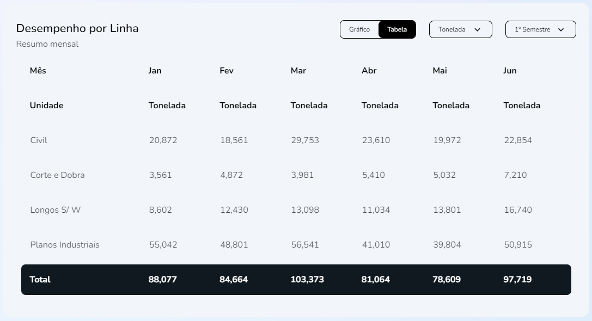
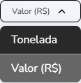

import Tabs from '@theme/Tabs';
import TabItem from '@theme/TabItem';

# Desempenho por toneladas 
## Método: PerformanceByLine
___


Tabela de desempenho por linha preenchida pela função `PerformanceByLineTable{}`


## Sintaxe
____
A função `PerformanceByLineTable{}` recupera as constantes `result` e `setParams` através do `useEffect()` nos itens `setParams`, `officeId`, `sellerId`, `unity` e `semester`.: 
```typescript
//src/pages/Seller/Dashboard/components/PerformanceByLine/Table/index.tsx
export function PerformanceByLineTable({officeId, sellerId, unity, semester}: Props) {
  const { result, setParams } = useSellerSemesterPerformanceByLine()

  useEffect(() => {
    setParams({ officeId, sellerId, unity, semester })
  }, [setParams, officeId, sellerId, unity, semester])
  return(...
  )
}
```
Hierarquicamente as variáveis são estabelecidas ``useSellerPerformanceByLine(){}``
```typescript
//src/hooks/Seller/useSemesterPerformanceByLine.ts
//Função:
export function useSellerSemesterPerformanceByLine() {
  const [params, setParams] = useState<Record<string, any> | null>(null)

  const [result, setResult] = useState<Response | undefined | null>(null)

  const fetchData = useCallback(async (params: Record<string, any>) => {
    try {
      setResult(null)

      await fakeRequest(2000, {
        officeId: params?.officeId || '',
        sellerId: params?.officeId || '',
        unity: params.unity,
        semester: params.semester
      })

      setResult(res)
    } catch {
      setResult(undefined)
    }
  }, [])

  useEffect(() => {
    params && fetchData(params)
  }, [params, fetchData])

  return { result, setParams }
}
```
O hook destes dados em `fetchData` utiliza `useState` dos elementos do objeto`ISellerSemesterPerformanceByLine{}` dentro do objeto `Response{}`, extraindo o array `data[]`  e o objeto  `total{}` para preencher o objeto `Props{}` com os valores de `res`.
```javascript
//src/hooks/Seller/useSemesterPerformanceByLine.ts
//Interface:
interface ISellerSemesterPerformanceByLine {
  productLineName: string
  firstMonthAmount: number
  firstMonthValue: number
  secondMonthAmount: number
  secondMonthValue: number
  thirdMonthAmount: number
  thirdMonthValue: number
  fourthMonthAmount: number
  fourthMonthValue: number
  fifthMonthAmount: number
  fifthMonthValue: number
  sixthMonthAmount: number
  sixthMonthValue: number
}
interface Response {
  data: ISellerSemesterPerformanceByLine[]
  total: Omit<ISellerSemesterPerformanceByLine, 'productLineName'>
}
```
```javascript
//src/hooks/Seller/useSemesterPerformanceByLine.ts
//Exemplos:
const res: Response = {
  data: [
    {
      productLineName: 'Civil',
      firstMonthAmount: 20.872,
      firstMonthValue: 87231,
      secondMonthAmount: 18.561,
      secondMonthValue: 76120,
      thirdMonthAmount: 29.753,
      thirdMonthValue: 105418,
      fourthMonthAmount: 23.61,
      fourthMonthValue: 82872,
      fifthMonthAmount: 19.972,
      fifthMonthValue: 68543,
      sixthMonthAmount: 22.854,
      sixthMonthValue: 76785
    },
    {
      productLineName: 'Corte e Dobra',
      firstMonthAmount: 3.561,
      firstMonthValue: 11784,
      secondMonthAmount: 4.872,
      secondMonthValue: 15432,
      thirdMonthAmount: 3.981,
      thirdMonthValue: 13432,
      fourthMonthAmount: 5.41,
      fourthMonthValue: 17654,
      fifthMonthAmount: 5.032,
      fifthMonthValue: 16731,
      sixthMonthAmount: 7.21,
      sixthMonthValue: 22862
    },
    {
      productLineName: 'Longos S/ W',
      firstMonthAmount: 8.602,
      firstMonthValue: 17507,
      secondMonthAmount: 12.43,
      secondMonthValue: 25413,
      thirdMonthAmount: 13.098,
      thirdMonthValue: 28689,
      fourthMonthAmount: 11.034,
      fourthMonthValue: 22140,
      fifthMonthAmount: 13.801,
      fifthMonthValue: 29015,
      sixthMonthAmount: 16.74,
      sixthMonthValue: 38705
    },
    {
      productLineName: 'Planos Industriais',
      firstMonthAmount: 55.042,
      firstMonthValue: 125432,
      secondMonthAmount: 48.801,
      secondMonthValue: 113754,
      thirdMonthAmount: 56.541,
      thirdMonthValue: 128612,
      fourthMonthAmount: 41.01,
      fourthMonthValue: 98762,
      fifthMonthAmount: 39.804,
      fifthMonthValue: 95302,
      sixthMonthAmount: 50.915,
      sixthMonthValue: 118054
    }
  ],
  total: {
    firstMonthAmount: 88.077,
    firstMonthValue: 241954,
    secondMonthAmount: 84.664,
    secondMonthValue: 230719,
    thirdMonthAmount: 103.373,
    thirdMonthValue: 276151,
    fourthMonthAmount: 81.064,
    fourthMonthValue: 221428,
    fifthMonthAmount: 78.609,
    fifthMonthValue: 209591,
    sixthMonthAmount: 97.719,
    sixthMonthValue: 256406
  }
}
````


 


## Parâmetros
Dropdown - `unity` |Dropdown - `semester`
---------|-----
 |


Parâmetros |Requerimento|Tipo de dado  | definição|
---------|-----|----------|---------
 `Props.officeId` |Requerido|number \| null| Número identificador de escritórios
 `Props.sellerId`|Requerido|number \| null| Número identificador de vendedores
 `Props.unity`|Requerido|string| Unidade de medida em que itens (toneladas ou valor)
 `Props.semester`|Requerido|string| Indicador de semestre par ou ímpar

>Os seguintes parâmetros correspondem aos são extraídos de `Response.ISellerSemesterPerformanceByLine`:
Parâmetros |Requerimento|Tipo de dado  | definição|
---------|-----|----------|---------
`data.productLineName` |Requerido|string| Nome da linha de produto
`data.firstMonthAmount` |Requerido|number| Quantidade vendida no primeiro mês
`data.firstMonthValue` |Requerido|number| Valor da venda no primeiro mês
`data.secondMonthAmount` |Requerido|number| Quantidade vendida no segundo mês
`data.secondMonthValue` |Requerido|number| Valor da venda no segundo mês
`data.thirdMonthAmount` |Requerido|number| ⋮
`data.thirdMonthValue` |Requerido|number| ⋮
`data.fourthMonthAmount` |Requerido|number| ⋮
`data.fourthMonthValue` |Requerido|number| ⋮
`data.fifthMonthAmount` |Requerido|number| ⋮
`data.fifthMonthValue` |Requerido|number| ⋮
`data.sixthMonthAmount` |Requerido|number|⋮
`data.sixthMonthValue` |Requerido|number| ⋮
`total.firstMonthAmount` |Requerido|number| Quantidade total de vendas no primeiro mês
`total.firstMonthValue` |Requerido|number| Valor  total de vendas no primeiro mês
`total.secondMonthAmount` |Requerido|number| Quantidade total de vendas no segundo mês
`total.secondMonthValue` |Requerido|number| Valor  total de vendas no primeiro mês
`total.thirdMonthAmount` |Requerido|number| ⋮
`total.thirdMonthValue` |Requerido|number| ⋮
`total.fourthMonthAmount` |Requerido|number|⋮
`total.fourthMonthValue` |Requerido|number| ⋮
`total.fifthMonthAmount` |Requerido|number| ⋮
`total.fifthMonthValue` |Requerido|number| ⋮
`total.sixthMonthAmount` |Requerido|number| ⋮
`total.sixthMonthValue` |Requerido|number| ⋮


## Procedures
### `PRC_VEND_PERF_LINHA`
Os parâmetros referidos seguem estas definições nas procedures do banco de dados:

Parâmetros |Requerimento|Tipo de dado  
---------|-----|----------
 `???` |???|??? 
 `???`|???|???
 `???`|???|???


## Valores de retorno
Com o sucesso da função a recuração `Read_only`dos dados é recuperado no display da home page. Um valor vazio não não gerará erro, contudo, não deverá apresentado em gráfico
<p></p>
<table>
<tr>
    <td>Request</td>
    <td>https://dev-easycrm.mtcorp.com.br/seller/dashboard</td>
</tr>
<tr>
    <td>Request Method</td>
    <td>GET</td>
</tr>
<tr>
    <td>Status Code:</td>
    <td>200</td>
</tr>
</table>


No caso de falha, alguma das mensagens de erro listadas serão apresentadas.

## Errors
Nome do erro | Código de erro |Definição
---|---|---
?????|?????|?????
