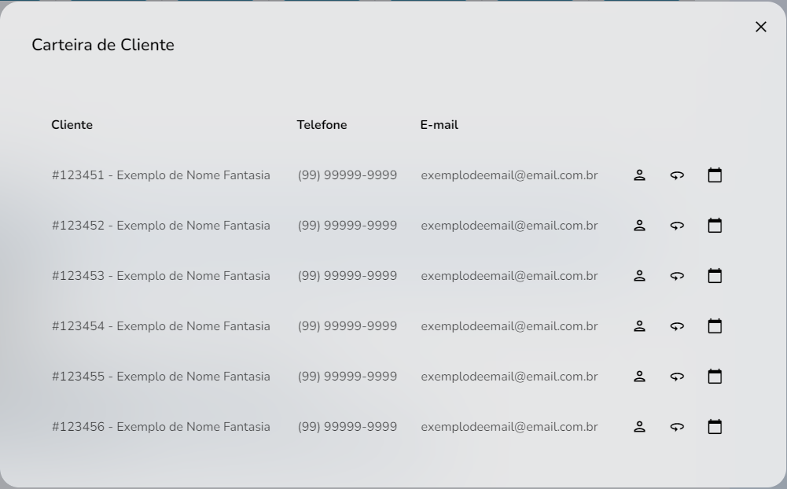

import Tabs from '@theme/Tabs';
import TabItem from '@theme/TabItem';

# Carteira de Clientes - modal
## Método: PorfolioByTypeModal 
___




## Sintaxe
____
A função `PortfolioByTypeModal{}` ativada com clique no gráfico de carteira de cliente, utiliza o hook `useState()` com os elementos `customerDetails` e `setCustomerDetails` e os elemetos `customerEvent` e `setCustomerEvent` do objeto `IPortfolioByType{}`. Os elementos do objeto ficam omitidos exceto por `phone` e `email` .   
```typescript
//src/pages/Seller/Dashboard/components/PortfolioByType/Modal/index.tsx
//Função:
export function PorfolioByTypeModal({ customerTypeId, onClose }: Props) {
  const navigate = useNavigate()

  const [customerDetails, setCustomerDetails] = useState<number | null>(null)

  const [customerEvent, setCustomerEvent] = useState<
    Omit<IPortfolioByType, 'phone' | 'email'> | undefined
  >(undefined)

  const [result, setResult] = useState<IPortfolioByType[] | undefined | null>(
    null
  )

  const fetchData = useCallback(async (customerTypeId: number) => {
    try {
      setResult(null)

      await fakeRequest(2000, { customerTypeId })

      setResult([
        {
          customerId: 123451,
          tradingName: 'Exemplo de Nome Fantasia',
          phone: '(99) 99999-9999',
          email: 'exemplodeemail@email.com.br'
        },
        {
          customerId: 123452,
          tradingName: 'Exemplo de Nome Fantasia',
          phone: '(99) 99999-9999',
          email: 'exemplodeemail@email.com.br'
        },
        {...}
      ])
    } catch {
      setResult(undefined)
    }
  }, [])

  useEffect(() => {
    customerTypeId && fetchData(customerTypeId)
  }, [fetchData, customerTypeId])
```

```typescript
//src/pages/Seller/Dashboard/components/PortfolioByType/Modal/index.tsx
//Interface:
interface IPortfolioByType {
  customerId: number
  tradingName: string
  phone: string
  email: string
}

interface Props {
  customerTypeId: number | null
  onClose: () => void
}
````
```typescript
//src/pages/Seller/Dashboard/components/PortfolioByType/Modal/index.tsx
//Exemplos de retorno:
const res: Props = {
  data: [
    {     
      customerId: 123451,
      tradingName: 'Exemplo de Nome Fantasia',
      phone: '(99) 99999-9999',
      email: 'exemplodeemail@email.com.br'
    },
    {
      customerId: 123452,
      tradingName: 'Exemplo de Nome Fantasia',
      phone: '(99) 99999-9999',
      email: 'exemplodeemail@email.com.br'
    },
    {...}
  ]
}
````
Com o erro ou falha da função, o resultado é setado como `indefinido`.

## Parâmetros

Parâmetros |Requerimento|Tipo de dado  | definição|
---------|-----|----------|---------
`customerId`|Requerido|number | Número de identificação de escritórios
`tradingName`|Requerido|string | Número de identificação de escritórios
`phone`|Requerido|string | Número de identificação de escritórios
`email`|Requerido|strin | Número de identificação de escritórios
`customerTypeId`|Requerido|number\|object  | Número de identificação de escritórios


## Procedures
### `PRC_VEND_GRAF_CONS`
Os parâmetros referidos seguem estas definições nas procedures do banco de dados:
Parâmetros |Requerimento|Tipo de dado  
---------|-----|----------
 `???` |???|??? 
 `???`|???|???
 `???`|???|???


## Valores de retorno
Com o sucesso da função a recuração `Read_only`dos dados é recuperado no display da home page. Um valor vazio não não gerará erro, contudo, não deverá apresentado em gráfico

<p></p>
<table>
<tr>
    <td>Request</td>
    <td>components/Rules/Customer/Modal/Details</td>
</tr>
<tr>
    <td>Request Method</td>
    <td>GET</td>
</tr>
<tr>
    <td>Status Code:</td>
    <td>200</td>
</tr>
</table>

No caso de falha, alguma das mensagens de erro listadas serão apresentadas.

## Errors
Nome do erro | Código de erro |Definição
---|---|---
?????|?????|?????
