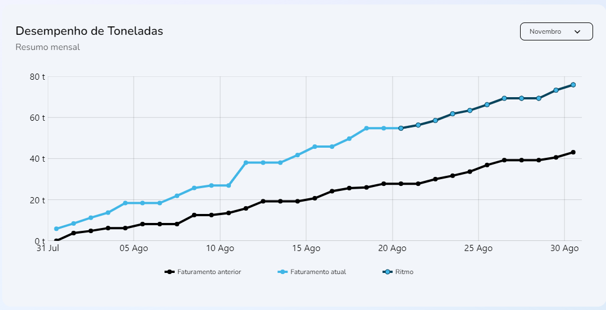

import Tabs from '@theme/Tabs';
import TabItem from '@theme/TabItem';

# Desempenho de toneladas: 
## Método: TonnePerformance
___



## Sintaxe
____
A função `TonnePerformance{}` que popula o gráfico acima recupera os as constantes `result`,`params` e `setParams` da função `useSellerTonnePerformance{}` estes criados através do `useCallback()` dos dados em `ISellerTonnePerformance{}`: 
```javascript
//src/hooks/Seller/useTonnePerformance.ts
//Função:
export function useSellerTonnePerformance() {  
  const fetchData = useCallback(async (params: Record<string, any>) => {
//[...]
    try {
      setResult(null)

      await fakeRequest(2000, {
        officeId: params?.officeId || '',
        sellerId: params?.officeId || '',
        month: params?.month
      })

      setResult(data)
    } catch {
      setResult(undefined)
    }
  }, [])
}
```
```javascript
//src/hooks/Seller/useTonnePerformance.ts
//Interface:
interface ISellerTonnePerformance {
  date: number
  pastYearAmount: number
  currentYearAmount?: number
  projectionAmount?: number
}
```
```javascript
//src/hooks/Seller/useTonnePerformance.ts
//Exemplos:
const data: ISellerTonnePerformance[] = [
  {
    date: new Date('2022-08-01').getTime(),
    pastYearAmount: 0,
    currentYearAmount: 5.872
  },
  {
    date: new Date('2022-08-02').getTime(),
    pastYearAmount: 3.761,
    currentYearAmount: 8.433
  }
//[...]
]
````


 
O array `months[]` em `useSystemParams{}`:

```javascript
//src/hooks/System/useParams.ts
//Exemplos:
export const useSystemParams = () => {
  return {
//[...]
    months: [
      {
        value: 1,
        label: 'Janeiro'
      },
      {
        value: 2,
        label: 'Fevereiro'
      },
      {
        value: 3,
        label: 'Março'
      },
    ]
  }
}
```
    
A função `TonnePerformance{}` recupera as constantes listadas em `useSystemParams{}` e `SellerTonnePerformance{}` e utilizando um hook `useEffect()` para aplicar os valores dessas constantes atreladas aos valores officeId e sellerId em `Props[]`:
```javascript
//src/pages/Seller/Dashboard/components/TonnePerformance/index.tsx
interface Props {
  officeId: number | null
  sellerId: number | null
}

export function TonnePerformance({ officeId, sellerId }: Props) {
  const theme = useTheme()

  const { months } = useSystemParams()
  const { result, params, setParams } = useSellerTonnePerformance()

  const currentMonth = new Date().getMonth() + 1

  useEffect(() => {
    setParams({ officeId, sellerId, month: currentMonth })
  }, [setParams, officeId, sellerId, currentMonth])
}
```

## Parâmetros

Dropdown - `months`|
---|
|


Parâmetros |Requerimento|Tipo de dado  | definição|
---------|-----|----------|---------
 `date` |Requerido|number| Data de efetuação de venda
 `pastYearAmount`|Requerido|number| Quantidade vendida, em toneladas, no ano anterior
 `currentYearAmount`|Requerido|number| Quantidade vendida, em toneladas, no ano atual
 `projectionAmount`|Requerido|number| Quantidade projetada de venda, em toneladas, para o ano
 `months.value`|Requerido|number| Numeração de meses
 `months.label`|Requerido|string| Nome de mês correspondente à sua numeração 
 `officeId`|Requerido|number \| null| Número de identificação de escritórios
 `sellerId`|Requerido|number \| null| Número de identificação de vendedores


## Procedures
### `PRC_VEND_GRAF_CONS`
Os parâmetros referidos seguem estas definições nas procedures do banco de dados:

Parâmetros |Requerimento|Tipo de dado  
---------|-----|----------
 `???` |???|??? 
 `???`|???|???
 `???`|???|???


## Valores de retorno
Com o sucesso da função a recuração `Read_only`dos dados é recuperado no display da home page. Um valor vazio não não gerará erro, contudo, não deverá apresentado em gráfico

<p></p>
<table>
<tr>
    <td>Request</td>
    <td>https://dev-easycrm.mtcorp.com.br/seller/dashboard</td>
</tr>
<tr>
    <td>Request Method</td>
    <td>GET</td>
</tr>
<tr>
    <td>Status Code:</td>
    <td>200</td>
</tr>
</table>

No caso de falha, alguma das mensagens de erro listadas serão apresentadas.

## Errors

Nome do erro | Código de erro |Definição
---|---|---
?????|?????|?????
