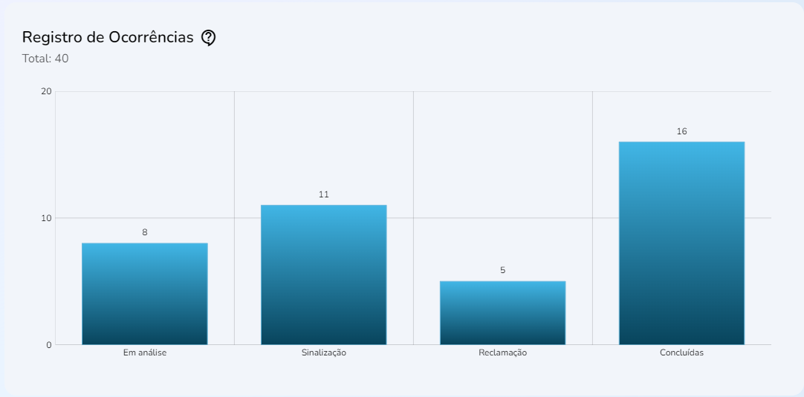

import Tabs from '@theme/Tabs';
import TabItem from '@theme/TabItem';

# Registro de ocorrências
## Método: useSellerOccurrencesRecord 
___




## Sintaxe
____
A função `UseSellerOccurencesRecord{}` tem um hook `useState()` nomeando os elementos `result` e `setResult` ccom base nos dados retirados do objeto `Response{}` levado em conta o array `data` com os elementos `occurenceId`, `occurenceName` e `amount` nomeados em `ISellerOccurrenceRecord{}` junto com o elemento `total`.
```typescript
//src/hooks/Seller/useOccurrencesRecord.ts
//Função:
export function useSellerOccurrencesRecord() {
  const [params, setParams] = useState<Record<string, any> | null>(null)

  const [result, setResult] = useState<Response | undefined | null>(null)

  const fetchData = useCallback(async (params: Record<string, any>) => {
    try {
      setResult(null)

      await fakeRequest(2000, {
        officeId: params?.officeId || '',
        sellerId: params?.officeId || ''
      })

      setResult(res)
    } catch {
      setResult(undefined)
    }
  }, [])

  useEffect(() => {
    params && fetchData(params)
  }, [params, fetchData])

  return { result, params, setParams }
}
```

```typescript
//src/hooks/Seller/useOccurrencesRecord.ts
//Interface:
interface ISellerOccurrenceRecord {
  occurenceId: number
  occurrenceName: string
  amount: number
}

interface Response {
  data: ISellerOccurrenceRecord[]
  total: number
}
````
```typescript
//src/hooks/Seller/useOccurrencesRecord.ts
//Exemplos de retorno:
const res: Response = {
  data: [
    {
      occurenceId: 1,
      occurrenceName: 'Em análise',
      amount: 8
    },
    {
      occurenceId: 2,
      occurrenceName: 'Sinalização',
      amount: 11
    },
    {
      occurenceId: 3,
      occurrenceName: 'Reclamação',
      amount: 5
    },
    {
      occurenceId: 4,
      occurrenceName: 'Concluídas',
      amount: 16
    }
  ],
  total: 40
}
````
Com o erro ou falha da função, o resultado é setado como `unndefined`.

## Parâmetros

Parâmetros |Requerimento|Tipo de dado  | definição|
---------|-----|----------|---------
`occurenceId`|Requerido|number | Número identificador da ocorrência
`occurenceName`|Requerido|string | Nome do tipo de ocorrência
`amount`|Requerido|number | Quantidade da ocorrência em questão
`data`|Requerido|object | Objeto que guarda os valores de `ISellerOccurrenceRecord`
`total`|Requerido|number| Número total de ocorrências


## Procedures
### `???_???_???`
Os parâmetros referidos seguem estas definições nas procedures do banco de dados:

Parâmetros |Requerimento|Tipo de dado  
---------|-----|----------
 `???` |???|??? 
 `???`|???|???
 `???`|???|???


## Valores de retorno
?????????
<p></p>
<table>
<tr>
    <td>Request</td>
    <td>components/Rules/Customer/Modal/Details</td>
</tr>
<tr>
    <td>Request Method</td>
    <td>GET</td>
</tr>
<tr>
    <td>Status Code:</td>
    <td>200</td>
</tr>
</table>

No caso de falha, alguma das mensagens de erro listadas serão apresentadas.

## Errors
Nome do erro | Código de erro |Definição
---|---|---
?????|?????|?????
