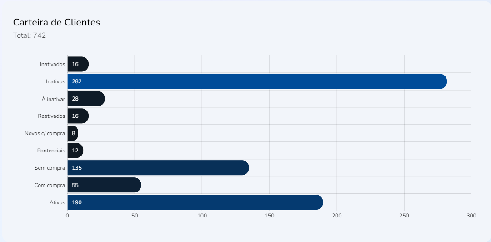

import Tabs from '@theme/Tabs';
import TabItem from '@theme/TabItem';

# Carteira de Clientes
## Método: useSellerPortfolioByType 
___



## Sintaxe
____
A função `useSellerPortfolioByType{}` que popula o gráfico acima gerencia os elementos do array `data` do objeto `Response{}` com o hook `useState` 
```typescript
//src/hooks/Seller/usePortfolioByType.ts
//Função:
export function useSellerPortfolioByType() {
  const [params, setParams] = useState<Record<string, any> | null>(null)

  const [result, setResult] = useState<Response | undefined | null>(null)

  const fetchData = useCallback(async (params: Record<string, any>) => {
    try {
      setResult(null)

      await fakeRequest(2000, {
        officeId: params?.officeId || '',
        sellerId: params?.officeId || ''
      })

      setResult(res)
    } catch {
      setResult(undefined)
    }
  }, [])

  useEffect(() => {
    params && fetchData(params)
  }, [params, fetchData])

  return { result, params, setParams }
}
```
```typescript
//src/hooks/Seller/usePortfolioByType.ts
//Interface:
interface ISellerPortfolioByType {
  customerTypeId: number
  customerTypeName: string
  amount: number
}

interface Response {
  data: ISellerPortfolioByType[]
  total: number
}
```

```typescript
//src/hooks/Seller/usePortfolioByType.ts
//Exemplo de retorno:
const res: Response = {
  data: [
    {
      customerTypeId: 1,
      customerTypeName: 'Ativos',
      amount: 190
    },
    {
      customerTypeId: 2,
      customerTypeName: 'Com compra',
      amount: 55
    },
    {
      customerTypeId: 3,
      customerTypeName: 'Sem compra',
      amount: 135
    },
    {...}
  ],
  total: 742
}
````


## Parâmetros

Parâmetros |Requerimento|Tipo de dado  | definição|
---------|-----|----------|---------
`customerTypeId`|Requerido|number | Número de identificação de escritórios
 `customerTypeName`|Requerido|string| Número de identificação de vendedores
 `amount` |Requerido|number| Data de efetuação de venda
 `data`|Requerido|object| Array com elementos de `ISellerPortfolioByType`
 `total`|Requerido|number| Somatória das quantidades vendidas
 


## Procedures
### `PRC_VEND_GRAF_CONS`
Os parâmetros referidos seguem estas definições nas procedures do banco de dados:
Parâmetros |Requerimento|Tipo de dado  
---------|-----|----------
 `???` |???|??? 
 `???`|???|???
 `???`|???|???


## Valores de retorno
Com o sucesso da função a recuração `Read_only`dos dados é recuperado no display da home page. Um valor vazio não não gerará erro, contudo, não deverá apresentado em gráfico

<p></p>
<table>
<tr>
    <td>Request</td>
    <td>https://dev-easycrm.mtcorp.com.br/seller/dashboard</td>
</tr>
<tr>
    <td>Request Method</td>
    <td>GET</td>
</tr>
<tr>
    <td>Status Code:</td>
    <td>200</td>
</tr>
</table>

No caso de falha, alguma das mensagens de erro listadas serão apresentadas.

## Errors

Nome do erro | Código de erro |Definição
---|---|---
?????|?????|?????
