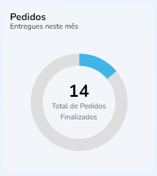

import Tabs from '@theme/Tabs';
import TabItem from '@theme/TabItem';

# Monthly proposals

## Method: OrderChart
--- 



### Summary
Chart for annual sales summary, with callback of `date` and `value` elements.

## Syntax
---
<Tabs
defaultValue="Function"
values={[
  {label: 'Function', value:'Function' },
  {label: 'Interface', value:'interface' },
  {label: 'Schema', value:'Schema'}
]
}>
<TabItem value="Function">

```typescript title="src/pages/home/index.tsx"
export function OrderChart() {
  const theme = useTheme()

  const [loading, setLoading] = useState(false)
  const [deliveredOrders, setDeliveredOrders] = useState<number | null>(null)

  const fetchData = useCallback(async () => {
    if (!loading) {
      try {
        setLoading(true)

        const { data } = await fakeRequest(2000, { deliveredOrders: 14 })

        if (data) {
          setDeliveredOrders(data.deliveredOrders)
        }
      } catch {
        setDeliveredOrders(0)
      } finally {
        setLoading(false)
      }
    }
  }, [loading])

  useEffect(() => {
    if (deliveredOrders === null) {
      fetchData()
    }
  }, [deliveredOrders, fetchData])

  useLayoutEffect(() => {...}

    return undefined
  }, [deliveredOrders, theme])

```
</TabItem>
<TabItem value="interface">

```typescript title="src/pages/Home/components/Summary/index.tsx"
interface ISummary {
  proposalsAboutToExpire: number | undefined
  finishedOrders: number | undefined
  deliveredOrders: number | undefined
}
```
</TabItem>
<TabItem value="Schema">

```json title="Schema de resposta"
{
  "Orderchart": {
    "type": "object",
    "properties": {
      "deliveredOrders": {
        "type": [
          "number"
        ],
        "format": "float",
        "example": 8,
        "minimum": 0
      },
      "loading": {
        "type": "boolean"
      }
    }
  }
}
```
</TabItem>
</Tabs>


## Description 
---
The `OrderChart` function has the `deliveredOrders` element (created in `ISummary`) and the `useState()` update `setDeliveredOrders` function. The function calls the `loading` value (created in `Props`) and updates its state with the `setLoading` function with the `useState` hook.

In case the `setDeliveredOrders` data fails to be found in `data.deliveredOrders` the function will be set to zero or, in case `setLoading` fails. Regardless of the result, the value of `setLoading` will be `false`.

## Parameters
---

Parameters |Tipo de dado  | Data type|
---------|----------|---------
 `loading` |boolean \| null| boolean indicating loading process
 `deliveredOrders` |number \| undefined| Weekly orders and deliveries
 `label` |string| Title or label for the card
 `value` |string \| number| Value to be displayed in the card
 `proposalsAboutToExpire` |number \| undefined| Number of proposals to be overdue on the week
 `finishedOrders` |number \| undefined| Weekly quantity of finalized orders


