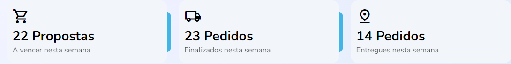

import Tabs from '@theme/Tabs';
import TabItem from '@theme/TabItem';

# Summary: hub de pedidos

## Método: Summary
--- 


### Resumo

Método de população de três parâmetros para <em>pospostas, pedidos realizados e pedidos entregues</em> em colunas organizadas em prazos semanais.


## Sintaxe
---
<Tabs
defaultValue="Função"
values={[
  {label: 'Função', value:'Função' },
  {label: 'Interface', value:'interface' },
  {label: 'Schema', value:'Schema'}
]
}>
<TabItem value="Função">

```typescript title="src/pages/home/components/Summary/index.tsx"

export function Summary() {
  const [result, setResult] = useState<ISummary>({
    proposalsAboutToExpire: undefined,
    finishedOrders: undefined,
    deliveredOrders: undefined
  })

  const fetchData = useCallback(async () => {
    try {
      const { data } = await fakeRequest(2000, {
        proposalsAboutToExpire: 22,
        finishedOrders: 23,
        deliveredOrders: 14
      })

      if (data) {
        setResult({
          proposalsAboutToExpire: data.proposalsAboutToExpire,
          finishedOrders: data.finishedOrders,
          deliveredOrders: data.deliveredOrders
        })
      }
    } catch {
      setResult({
        proposalsAboutToExpire: 0,
        finishedOrders: 0,
        deliveredOrders: 0
      })
    }
  }, [])

  useEffect(() => {
    const { proposalsAboutToExpire, finishedOrders, deliveredOrders } = result

    if (
      proposalsAboutToExpire === undefined ||
      finishedOrders === undefined ||
      deliveredOrders === undefined
    ) {
      fetchData()
    }
  }, [result, fetchData])

  return (...)
}
```
</TabItem>
<TabItem value="interface">

```typescript title="src/pages/home/components/Summary/index.tsx"

interface ISummary {
  proposalsAboutToExpire: number | undefined
  finishedOrders: number | undefined
  deliveredOrders: number | undefined
}
```
</TabItem>
<TabItem value="Schema">

```json title="Schema de resposta"
{
  "$schema": "http://services/api"
  
  "Summary": {
    "type": "object",
    "properties": {
      "proposalsAboutToExpire": {
        "type": "number",
         "format": "double",
         "minimum": 0,
          "example": 15,
          "readOnly": true
      },
      "finishedOrders": {
        "type": "number",
        "example": 23
      },
      "deliveredOrders": {
        "type": "number",
         "example": 42
      }
    },
    "readOnly": true
  }
}
```
</TabItem>
</Tabs>

## Descrição 
---
População da função `Summary`, preenchendo uma linha com três colunas criando um resumo dos pedidos realizados no período de uma semana.A função tomará os dados `proposalsAboutToExpire`, `finishedOrders` e `deliveredOrders` do objeto `ISummary` através de um hook `useState`, populando as constantes `result` e `setResult`. No caso de ausência na adequação ao prazo deve haver o display de valor `0` nos três parâmetros.


## Parâmetros
---
Parâmetros |Requerimento|Tipo de dado  | definição|
---------|-----|----------|---------
 `proposalsAboutToExpire` |Sim|number\|undefined| Número de propostas a vencer na semana
 `finishedOrders`|Sim|number\|undefined| Número de pedidos finalizados na semana
 `deliveredOrders`|Sim|number\|undefined| Pedidos ou entregas realizadas nesta semana 

### Procedures
 `PROC_RESU_PEDI_CONST`

Os parâmetros referidos seguem estas definições nas procedures do banco de dados:

Parâmetros |Requerimento|Tipo de dado  
:---------:|:-----:|:----------:
 `@NR_PROP_EXPI` |Sim|INT 
 `@NR_PROP_CONC`|Sim|INT
 `@NR_PROP_ENTR`|Sim|INT
`@UUID_USUA`|Sim|VARCHAR(36)

## Valores de retorno
---
Com o sucesso da função a recuração `Read_only`dos dados é recuperado no display da home page. No caso de ausência de valores, será apresentado o valor `0` nas três  lacunas


<p></p>
<table>
<tr>
    <td>Request</td>
    <td>/easy-crm/src/pages/home/components/Summary</td>
</tr>
<tr>
    <td>Request Method</td>
    <td>GET</td>
</tr>
<tr>
    <td>Status Code:</td>
    <td>200</td>
</tr>
</table>

No caso de falha, alguma das mensagens de erro listadas podem ser apresentadas.

## Errors
---

Nome do erro | Código de erro |Definição
---|---|---
USER_NOT_FOUND| |Id do cliente não foi encontrada