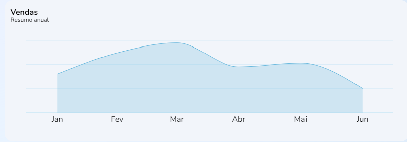

import Tabs from '@theme/Tabs';
import TabItem from '@theme/TabItem';
import Mermaid from '@site/src/theme/Mermaid';


# AnnualSales: resumo anual de vendas

## Método: AnnualSales
--- 



### Resumo
Gráfico para resumo de vendas anual, com callback de elementos `date` e `value`.


## Sintaxe
---
<Tabs
defaultValue="Função"
values={[
  {label: 'Função', value:'Função' },
  {label: 'Interface', value:'interface' },
  {label: 'Schema', value:'Schema'}
]
}>
<TabItem value="Função">

```typescript title="src/pages/Home/components/SalesChart/index.tsx"

export function SalesChart() {
  const theme = useTheme()

  const [loading, setLoading] = useState(false)
  const [annualSales, setAnnualSales] = useState<IAnnualSales[] | null>(null)

  const fetchData = useCallback(async () => {
    if (!loading) {
      try {
        setLoading(true)

        const { data } = await fakeRequest(2000, {
          sales: [
            {
              date: new Date('2022-01-31').getTime(),
              value: 80
            },
            {
              date: new Date('2022-02-28').getTime(),
              value: 124
            },
            {...}
          ]
        })

        if (data) {
          setAnnualSales(data.sales)
        }
      } catch {
        setAnnualSales([])
      } finally {
        setLoading(false)
      }
    }
  }, [loading])

  useEffect(() => {...}, [annualSales, theme])

  return (...)
}
```
</TabItem>
<TabItem value="interface">

```typescript title="src/pages/Home/components/SalesChart/index.tsx"

interface IAnnualSales {
  date: number
  value: number
}
```
</TabItem>
<TabItem value="Schema">

```json title="SCHEMA de resposta"

{
  "$schema": "http://services/api"

  "AnnualSales": {
    "type": "object",
    "properties": {
      "date": {
        "type": "number",
        "example": "2022-01-31",
        "format": "date",
        "readOnly": true
      },
      "value": {
        "type": "number",
        "format": "double",
        "default": 0,
        "example": 124,
        "minimum": 0,
        "readOnly": true
      }
    }
  }
}
```
</TabItem>
</Tabs>

## Descrição 
---
A função `SalesChart()` leva um hook `useState()` para construir os elementos`annualSales` e `setAnnualSales` a partir dos valores de `date` e `value` no objeto `IAnnualSales{}`


## Parâmetros
---
Parâmetros |Requerimento|Tipo de dado  | definição|
---------|-----|----------|---------
 `date` |Não|number| Período de tempo em que o pedido foi realizado
 `value`|Não|number| Número de pedidos realizados no período 


### Procedures
### `PRC_VEND_GRAF_CONS`
Os parâmetros referidos seguem estas definições a partir do banco de dados:

Parâmetros |Requerimento|Tipo de dado  
---------|-----|----------
`@DT_VEND` |Sim|DATE
`@NM_VEND_DATA`|Sim|INT
`@NR_PAGE_INIC`|Sim| INT
`@UUID_USUA`|Sim|VARCHAR(36)
`@UUID_VEND`|Sim|VARCHAR(36)


## Valores de retorno
---
Com o sucesso da função a recuração `Read_only`dos dados é recuperado no display da home page. Um valor vazio não não gerará erro, contudo, não deverá apresentado em gráfico


<table>
  <tr>
    <td>Request</td>
    <td>/easy-crm/src/pages/home/components/SalesChart</td>
  </tr>
  <tr>
    <td>Request Method</td>
    <td>GET</td>
  </tr>
  <tr>
    <td>Status Code:</td>
    <td>200</td>
  </tr>
</table>

No caso de falha, alguma das mensagens de erro listadas serão apresentadas.

## Errors
---
Nome do erro | Código de erro |Definição
---|---|---
?????|?????|?????