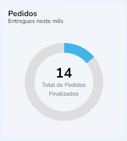

import Tabs from '@theme/Tabs';
import TabItem from '@theme/TabItem';

# Propostas por mês

## Método: OrderChart
--- 



### Resumo
Gráfico para resumo de vendas anual, com callback de elementos `date` e `value`.

## Sintaxe
---
<Tabs
defaultValue="Função"
values={[
  {label: 'Função', value:'Função' },
  {label: 'Interface', value:'interface' },
  {label: 'Schema', value:'Schema'}
]
}>
<TabItem value="Função">

```typescript title="src/pages/home/index.tsx"
export function OrderChart() {
  const theme = useTheme()

  const [loading, setLoading] = useState(false)
  const [deliveredOrders, setDeliveredOrders] = useState<number | null>(null)

  const fetchData = useCallback(async () => {
    if (!loading) {
      try {
        setLoading(true)

        const { data } = await fakeRequest(2000, { deliveredOrders: 14 })

        if (data) {
          setDeliveredOrders(data.deliveredOrders)
        }
      } catch {
        setDeliveredOrders(0)
      } finally {
        setLoading(false)
      }
    }
  }, [loading])

  useEffect(() => {
    if (deliveredOrders === null) {
      fetchData()
    }
  }, [deliveredOrders, fetchData])

  useLayoutEffect(() => {...}

    return undefined
  }, [deliveredOrders, theme])

```
</TabItem>
<TabItem value="interface">

```typescript title="src/pages/Home/components/Summary/index.tsx"
interface ISummary {
  proposalsAboutToExpire: number | undefined
  finishedOrders: number | undefined
  deliveredOrders: number | undefined
}
```
</TabItem>
<TabItem value="Schema">

```json title="Schema de resposta"
{
  "Orderchart": {
    "type": "object",
    "properties": {
      "deliveredOrders": {
        "type": [
          "number"
        ],
        "format": "float",
        "example": 8,
        "minimum": 0
      },
      "loading": {
        "type": "boolean"
      }
    }
  }
}
```
</TabItem>
</Tabs>


## Descrição 
---
A função `OrderChart` possui os elementos `deliveredOrders` (criado em `ISummary`) e a função `useState()` de atualização `setDeliveredOrders`. A função chama o valor de `loading` (criado em `Props`) e a atualiza seu state com a função `setLoading` com o gancho `useState`.

No caso das dados de `setDeliveredOrders` falharem em ser encontrados em `data.deliveredOrders` a função será setada em zero ou, no caso de falha no carregamento de `setLoading`. Independente do resultado, o valor de `setLoading` será  `false`.

## Parâmetros
---

Parâmetros |Requerimento|Tipo de dado  | definição|
---------|-----|----------|---------
 `loading` |Requerido|boolean \| null| booleano de carregamento
 `deliveredOrders` |Requerido|number \| undefined| Pedidos ou entregas realizadas nesta semana
 `label` |Não requerido|string| Texto para o rótulo do card
 `value` |Não requerido|string \| number| Valor para ser apresentado no card
 `proposalsAboutToExpire` |Não requerido|number \| undefined| Número de propostas a vencer na semana
 `finishedOrders` |Não requerido|number \| undefined| Número de pedidos finalizados na semana


### Procedures
### `???`

Os parâmetros referidos seguem estas definições nas procedures do banco de dados:

Parâmetros |Requerimento|Tipo de dado  
---------|-----|----------
 `???` |???|??? 
 `???`|???|???
 `???`|???|???

## Valores de retorno
---
Com o sucesso da função a recuração `Read_only`dos dados é recuperado no display da home page. No caso de ausência de valores, será apresentado o valor `0` nas três  lacunas


<p></p>
<table>
<tr>
    <td>Request</td>
    <td>pages/User/Profile</td>
</tr>
<tr>
    <td>Request Method</td>
    <td>GET</td>
</tr>
<tr>
    <td>Status Code:</td>
    <td>200</td>
</tr>
</table>

No caso de falha, alguma das mensagens de erro listadas serão apresentadas.

## Errors
---

Nome do erro | Código de erro |Definição
---|---|---
USER_NOT_FOUND| |Id do cliente não foi encontrada