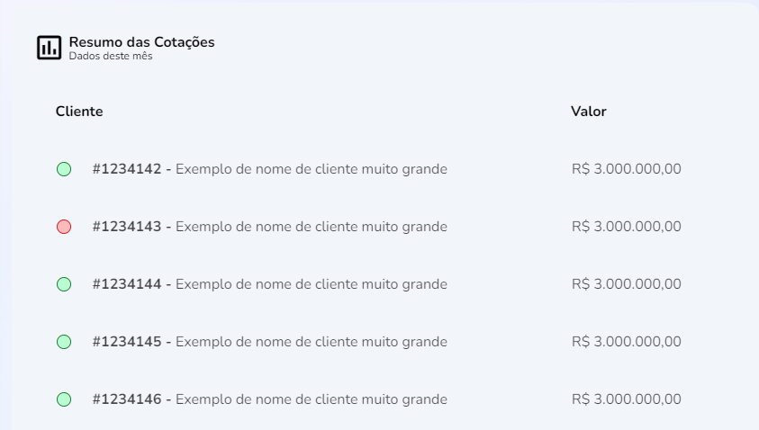

import Tabs from '@theme/Tabs';
import TabItem from '@theme/TabItem';

# PriceQuotes: resumo de cotações

## Método: PriceQuotes
--- 


### Resumo
Método de população de quatro parâmetros para <em>identificação, status, nome comercial e valor</em> para o quadro de resumo de quotações na Home-page.

## Sintaxe
---
<Tabs
defaultValue="função"
values={[
  {label: 'Função', value:'função' },
  {label: 'Interface', value:'interface' },
  {label: 'Retorno', value:'retorno'},
  {label: 'Schema', value:'schema'}
]
}>
<TabItem value="função">

```typescript title="src/pages/home/components/PriceQuotes/index.tsx"

export function PriceQuotes() {
  const [result, setResult] = useState<IPriceQuote[] | null>(null)

  const fetchData = useCallback(async () => {
    try {
      const { data } = await fakeRequest(2000, {
        quotes: [
          {
            id: 1234142,
            status: 'active',
            tradingName: 'Exemplo de nome de cliente muito grande',
            value: 3000000
          },
          {
            id: 1234143,
            status: 'inactive',
            tradingName: 'Exemplo de nome de cliente muito grande',
            value: 3000000
          },
          {...}
        ]
      })

      if (data) {
        setResult(data.quotes)
      }
    } catch {
      setResult([])
    }
  }, [])
```
</TabItem>
<TabItem value="interface">

```typescript title="src/pages/home/components/PriceQuotes/index.tsx"
interface IPriceQuote {
  id: number
  status: 'active' | 'inactive'
  tradingName: string
  value: number
}
```
</TabItem>
<TabItem value="retorno">

```typescript title="src/pages/home/components/PriceQuotes/index.tsx"

{
  PriceQuotes[{
      id: 1234142,
      status: 'active',
      tradingName: 'Exemplo de nome de cliente muito grande',
      value: 3000000
    },
    {
      id: 1234143,
      status: 'inactive',
      tradingName: 'Exemplo de nome de cliente muito grande',
      value: 300000
    },
    {
      id: 1234144,
      status: 'active',
      tradingName: 'Exemplo de nome de cliente muito grande',
      value: 3000000
    }
    {
      id: 1234145,
      status: 'active',
      tradingName: 'Exemplo de nome de cliente muito grande',
      value: 3000000 
    }
    {
      id: 1234146,
      status: 'active',
      tradingName: 'Exemplo de nome de cliente muito grande',
      value: 3000000
    }
  ]
}
```

</TabItem>
<TabItem value="schema">

```json title="Schema de resposta"
{
  "$schema": "http://services/api"

  "PriceQuotes": {
    "type": "object",
    "properties": {
      "id": {
        "type": "integer",
        "example": 1234142,
        "minimum": 0,
        "readOnly": true
      },
      "status": {
        "type": "string",
        "pattern": "(?:^|\\W)active|inactive(?:$|\\W)",
        "example": "active | inactive"
        },
      "tradingName": {
        "type": "string",
        "pattern": "[A-Z a-z]",
        "example": "Exemplo de nome de cliente muito grande"
      },
      "value": {
        "type": "number",
        "format": "double",
        "example": 30000,
        "minimum": 0,
        "readOnly": true
      }
    }
}
```
</TabItem>
</Tabs>


:::info Rotas utilizadas
A API dependerá da importação da rota `ROUTE_SELLER_DASHBOARD`
```javascript
  import { ROUTE_SELLER_DASHBOARD } from 'routes/Pages/Seller/paths'
```
:::

## Descrição 
---
A função `PriceQuotes{}` tem um hook `useState` para os elementos do objeto `IPriceQuote`, utilizando os elementos `id`, `status`, `tradingName` e `value`.

## Parâmetros
---
Parâmetros |Requerimento|Tipo de dado  | definição|
---------|-----|----------|---------
 `id` |Sim|number| código identificador de cliente
 `status`|Sim  | string | indicador de atividade
 `tradingName`| Não | string | nome comercial do cliente 
 `value`| Sim | number | valor da cotações

<p></p>

:::info A variável 'status' aceitará apenas os valores `active`🟢 ou `inactive`🔴, cada um possuindo um color-code associado:
 
 **Status**|**Color code**|**Type**
 -----|-----|-----
 active | #BBFBD1 | string
 inactive | #FBBBBB| string
:::

### Procedures
### `PRC_RESU_COTA_CONS`
Os parâmetros referidos seguem estas definições a partir do banco de dados:

Parâmetros |Requerimento|Tipo de dado  
---------|-----|----------
`@ID_COTA_CLIEN` |Sim|INT
`@IN_STAT`|Sim| BIT
`@NM_COTA_CLIEN`|Sim|VARCHAR(100)
`@NR_COTA_VALO`|Sim|MONEY
`@UUID_USUA`|Sim|VARCHAR(36)
`@UUID_VEND`|Sim|VARCHAR(36)

## Valores de retorno
---
PriceQuotes - Se a função for bem sucedida, os valores de `id` serão retornados acompanhados do `status`, `tradingName` e `value` associados ao cliente. 
<p></p>
<table>
<tr>
    <td>Request</td>
    <td>/easy-crm/src/pages/home/components/PriceQuotes</td>
</tr>
<tr>
    <td>Request Method</td>
    <td>GET</td>
</tr>
<tr>
    <td>Status Code:</td>
    <td>200</td>
</tr>
</table>

No caso de falha, alguma das mensagens de erro listadas serão apresentadas.

## Errors
---

Nome do erro | Código de erro |Definição
---|---|---
ID_NOT_FOUND| |Id do cliente não foi encontrada